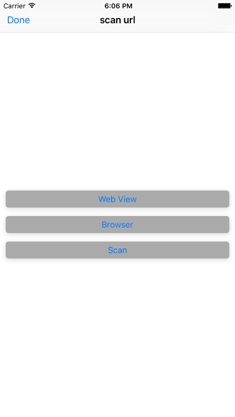

# PSLaunch
PS Launch for PeopleSoft or other websites

This is a simple IOS application that was created to allow the user to scan a URL from a QR Code or other image.

The original intent was to be used with a PeopleSoft environment but since you can encode any url, you can use the application to go to any url that you can scan.

XCode 7.3.1

Swift 2

Use:

Generate a QR Code. You can use any website that can generate a QR Code usint a URL as data.
On the application tap the Scan button and once you grant access to the camera, it can start scanning the image. The url will be read from the image and stored on your device.
You can open the URL as webview which does not contain the web address and only allows https URLs. 
You can open the URL on a browser. This can be either a http or https.

